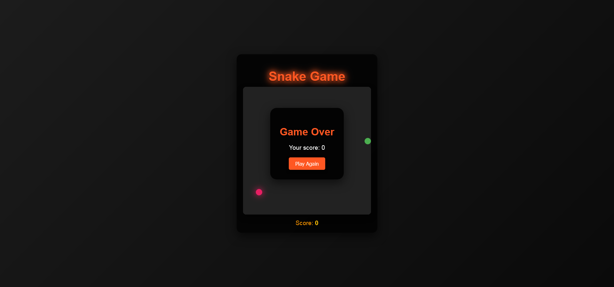

# Snake Game

A modern take on the classic Snake Game. Built with HTML, CSS, and JavaScript, this game offers a sleek design and smooth gameplay experience.

## Features

- **Responsive Design**: Play the game on any device with ease.
- **Dynamic Gameplay**: Food appears randomly, and the snake grows as you eat food.
- **Score Tracking**: Real-time score updates as you progress.
- **Game Over Screen**: Displays the final score and a restart button.
- **Keyboard Controls**: Navigate the snake using arrow keys.

## Setup and Usage

1. **Clone the Repository**:
   ```bash
   git clone https://github.com/bahaamohammed/snake-game-web.git
   ```

2. **Navigate to the Project Directory**:
   ```bash
   cd snake-game-web
   ```

3. **Run the Game**:
   Open `index.html` in any modern web browser.

## Game Controls

- **Arrow Up**: Move snake up.
- **Arrow Down**: Move snake down.
- **Arrow Left**: Move snake left.
- **Arrow Right**: Move snake right.

## How to Play

1. Use the arrow keys to control the direction of the snake.
2. Eat the food (pink circle) to grow longer and increase your score.
3. Avoid colliding with the walls or yourself.
4. When the game ends, click "Play Again" to restart.

## Files Overview

- `index.html`: The main structure of the game.

## Screenshot



## Technologies Used

- HTML5 Canvas for rendering the game.
- CSS3 for styling and animations.
- Vanilla JavaScript for game logic.

## Contributing

Feel free to fork the repository and submit pull requests. Contributions are always welcome!

## Acknowledgments

Special thanks to the open-source community for inspiration and resources.
